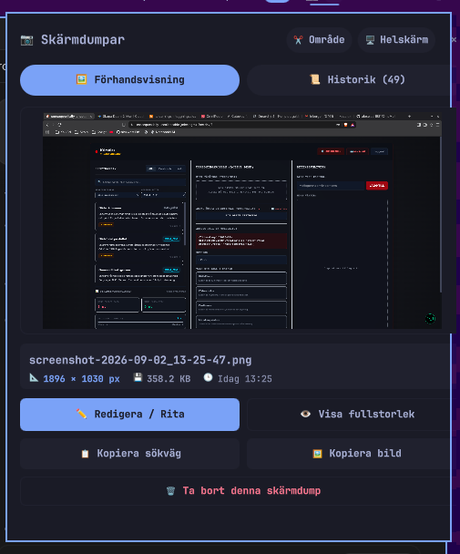

# OmaShot 📸✨

A fast, beautiful, and interactive **Screenshot Manager & Quick Capture status bar widget** built natively for **[Omarchy](https://omarchy.org)** and **Quickshell**.

Capture screen regions, view instant high-resolution previews, edit and annotate with a single click, browse full visual screenshot history, and effortlessly share screenshots with system tools and AI coding assistants (**Antigravity**, **Claude in VS Code**, **Gemini CLI**, **Cursor**).



---

## ✨ Features

* **📸 Status Bar Quick Capture:**
  * **Vänsterklick:** Open the interactive preview & history popup.
  * **Högerklick:** Instant region selection capture (`✂️ Område` via `omarchy-capture-screenshot smart`).
  * **Mittenklick:** Instant fullscreen capture (`🖥️ Helskärm`).
* **🖼️ Instant High-Res Preview (Flik 1):**
  * Displays the newest or selected screenshot with crisp aspect ratio fitting and a dark viewport background.
  * Detailed metadata bar: Filename, exact pixel resolution (`1896 × 1030 px`), file size (`358.2 KB`), and relative timestamps (`Idag 13:25`, `Nyss`).
* **🤖 AI & System-Wide Integration (Claude, Gemini, Antigravity):**
  * **Auto-Symlinks:** Automatically maintains `~/Pictures/latest-screenshot.png` and `/tmp/latest-screenshot.png` pointing to the newest screenshot. AI assistants can read this path directly anytime!
  * **📋 Kopiera sökväg:** Copies the absolute file path (e.g. `/home/alex/Pictures/screenshot-2026-09-02_17-26-45.png`) to your clipboard with a single click so you can paste it straight into chat prompts.
  * **🖼️ Kopiera bild:** Puts raw PNG bytes directly onto the Wayland clipboard (`wl-copy`) for pasting images into chat, browser, Discord, or documents.
* **✏️ One-Click Annotation & Editing:**
  * Launch Omarchy's official **Tensaku** annotator (`tensaku-edit`) or **Pinta** with one click to crop, draw arrows, highlight, add boxes, or blur sensitive details.
* **👁️ Fullscreen Image Viewer:**
  * Click on the preview image or the **`👁️ Visa fullstorlek`** button to open the image in **imv**.
* **📜 Screenshot History Gallery (Flik 2):**
  * Scrollable list of all previous screenshots in `~/Pictures`.
  * Individual cards with live thumbnails (`56 × 48 px`), filenames, resolution dimensions, file sizes, and timestamps.
  * Quick action icons on every single row: **`✏️` Redigera**, **`📋` Kopiera sökväg**, **`👁️` Visa**, **`🗑️` Ta bort**.
  * Clicking any card loads it immediately into the large **Förhandsvisning** tab.
* **🗑️ Safe File Deletion:**
  * Delete unneeded screenshots with a global confirmation dialog showing the target filename before deletion.

---

## 📦 Installation

### 1. Clone into your Omarchy plugins directory

```bash
git clone https://github.com/alexwest1981/OmaShot.git ~/.config/omarchy/plugins/custom.screenshots
```

### 2. Enable in `~/.config/omarchy/shell.json`

Add `custom.screenshots` to your `bar.layout.right`:

```json
{
  "bar": {
    "layout": {
      "right": [
        { "id": "custom.email" },
        { "id": "custom.screenshots" },
        { "id": "omarchy.tray" }
      ]
    }
  }
}
```

### 3. Restart Omarchy Shell

```bash
omarchy-restart-shell
```

---

## 🤖 How AI Assistants Access Screenshots

OmaShot is built from the ground up to make screenshots effortless for AI pair programming:

### Method 1: Automatic `latest-screenshot.png` Symlink
Simply tell Antigravity, Claude, or Gemini in your prompt:
> *"Kika på skärmdumpen i `~/Pictures/latest-screenshot.png` och hjälp mig fixa layouten."*

### Method 2: Copy Path (`📋 Kopiera sökväg`)
1. Click **`📋 Kopiera sökväg`** in OmaShot.
2. Paste (`Ctrl+V`) directly into the prompt:
> *"Se här: `/home/alex/Pictures/screenshot-2026-09-02_17-26-45.png`"*

### Method 3: Copy Image Data (`🖼️ Kopiera bild`)
1. Click **`🖼️ Kopiera bild`** in OmaShot.
2. Hit `Ctrl+V` in chat interfaces supporting direct image pasting.

---

## 🖱️ Controls & Shortcuts

| Action | Trigger |
| :--- | :--- |
| **Öppna galleri / Preview** | Vänsterklicka på kameraikonen `📷` |
| **Ta skärmdump (Område)** | Högerklicka på `📷` eller klicka på `✂️ Område` i popupen |
| **Ta skärmdump (Helskärm)** | Mittenklicka på `📷` eller klicka på `🖥️ Helskärm` i popupen |
| **Redigera / Rita** | Klicka på `✏️ Redigera / Rita` (öppnar Tensaku / Pinta) |
| **Visa i fullskärm** | Klicka på förhandsvisningsbilden eller `👁️ Visa fullstorlek` |
| **Kopiera filväg för AI** | Klicka på `📋 Kopiera sökväg` |
| **Kopiera bild till urklipp** | Klicka på `🖼️ Kopiera bild` |
| **Ta bort skärmdump** | Klicka på `🗑️ Ta bort denna skärmdump` |

---

## 📂 Project Architecture

```
OmaShot/
├── BarWidget.qml           # Quickshell / QtQuick user interface & popup window
├── screenshot_manager.py   # High-speed Python backend (metadata probe, symlinks, CLI actions)
├── manifest.json           # Omarchy plugin descriptor
├── screenshot.png          # UI preview screenshot
└── README.md               # Documentation & setup guide
```

---

## 📄 License

MIT License © 2026 [Alex Weström](https://github.com/alexwest1981)
